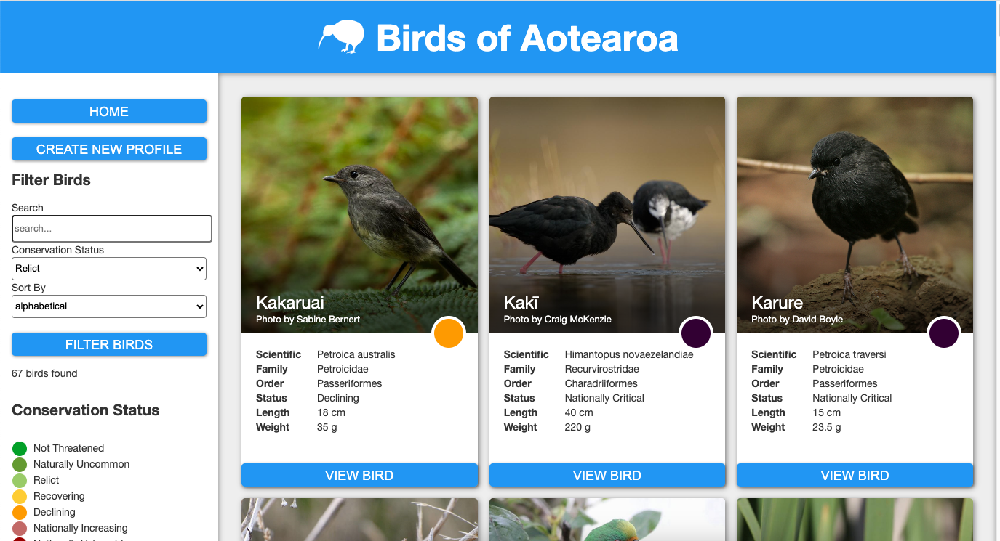
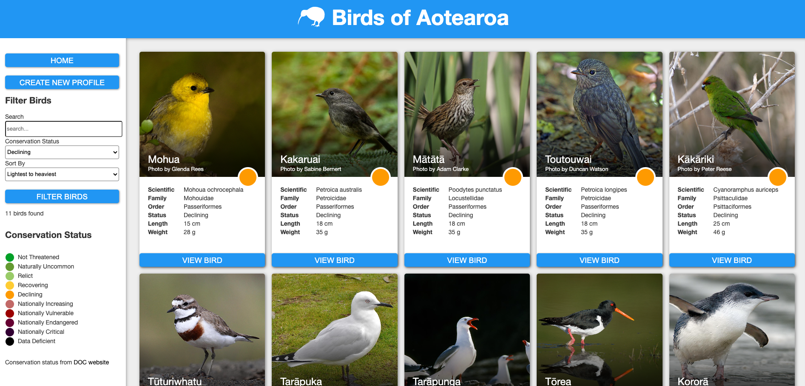
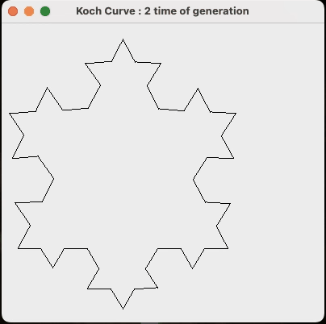

### Hi there 👋, I'm Kris

<!--
**vicmon810/vicmon810** is a ✨ _special_ ✨ repository because its `README.md` (this file) appears on your GitHub profile.

Here are some ideas to get you started:

- 🔭 I’m currently working on ...
- 🌱 I’m currently learning ...
- 👯 I’m looking to collaborate on ...
- 🤔 I’m looking for help with ...
- 💬 Ask me about ...
- 📫 How to reach me: ...
- 😄 Pronouns: ...
- ⚡ Fun fact: ...
-->

# GitHub Repositories

## [Otago Market Place](https://github.com/vicmon810/Otago__Market__place)
A digital marketplace for University of Otago staff to exchange office essentials efficiently.

  
  
  

## [Birds of NZ](https://github.com/vicmon810/Brids-of-NZ)
Discover and learn about New Zealand's bird species with a user-friendly catalog.

  
  

## [Koch Curve](https://github.com/vicmon810/Koch_curve)
Explore the fractal beauty of the Koch snowflake curve.

  

---

  

