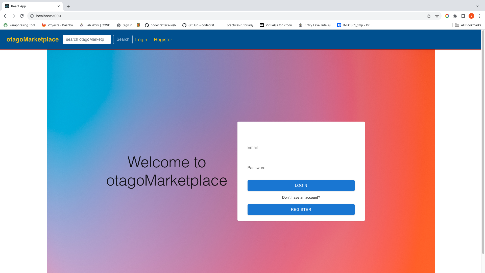
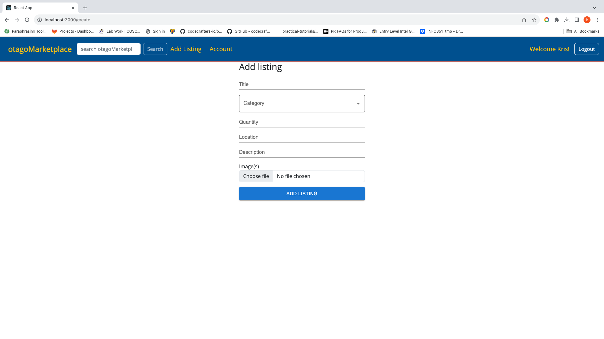
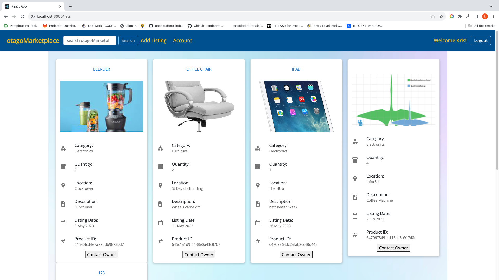

### Hi there 👋, I'm Kris There is what I'm doing right now: 

<!--
**vicmon810/vicmon810** is a ✨ _special_ ✨ repository because its `README.md` (this file) appears on your GitHub profile.

Here are some ideas to get you started:

- 🔭 I’m currently working on ...
- 🌱 I’m currently learning ...
- 👯 I’m looking to collaborate on ...
- 🤔 I’m looking for help with ...
- 💬 Ask me about ...
- 📫 How to reach me: ...
- 😄 Pronouns: ...
- ⚡ Fun fact: ...
-->
# GitHub Repositories

## [Otago__Market__place](https://github.com/vicmon810/Otago__Market__place)

  
  
  

## [Brids-of-NZ](https://github.com/vicmon810/Brids-of-NZ)
- **Language:** Pug
- **Last Updated:** Recently

## [mini-shell](https://github.com/vicmon810/mini-shell)
- **Language:** C
- **Last Updated:** Recently

## [3D-Renderer](https://github.com/vicmon810/3D-Renderer)
- **Language:** TypeScript
- **Last Updated:** Recently

## [Space_Ship_101](https://github.com/vicmon810/Space_Ship_101)
- **Last Updated:** Recently

## [massive_number_calculator](https://github.com/vicmon810/massive_number_calculator)
- **Language:** C++
- **Last Updated:** Recently

## [rewards-converter](https://github.com/vicmon810/rewards-converter) (Forked)
- **Language:** Java
- **Last Updated:** Recently

## [COSC345](https://github.com/vicmon810/COSC345)
- **Language:** C++
- **Last Updated:** Recently

## [Info351](https://github.com/vicmon810/Info351)
- **Last Updated:** Recently

## [Debugging](https://github.com/vicmon810/Debugging)
- **Language:** C
- **Last Updated:** Recently

## [world_in_CS](https://github.com/vicmon810/world_in_CS)
- **Language:** Python
- **Last Updated:** Recently

## [Koch_curve](https://github.com/vicmon810/Koch_curve)
- **Language:** Java
- **Last Updated:** Recently

## [cs_app](https://github.com/vicmon810/cs_app)
- **Language:** C#
- **Last Updated:** Recently

## [GO_language_parctice](https://github.com/vicmon810/GO_language_parctice)
- **Language:** Go
- **Last Updated:** Recently

## [react-tetris](https://github.com/vicmon810/react-tetris) (Forked)
- **Language:** JavaScript
- **Last Updated:** Recently

## [COSC343-AI](https://github.com/vicmon810/COSC343-AI)
- **Language:** Python
- **Last Updated:** Recently

## [my_SQL.c](https://github.com/vicmon810/my_SQL.c)
- **Language:** C
- **Last Updated:** Recently
