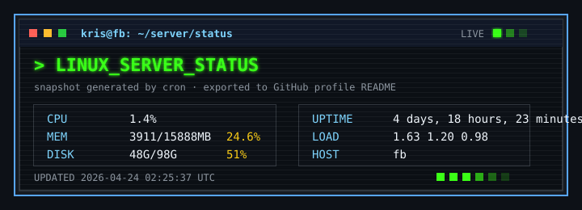
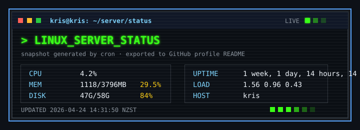

# Hi, I'm Kris Mao 👋

Master of Data Science student at the University of Auckland.  
I build practical AI and data systems with Python, focusing on reliability, automation, and real-world integration.

---

## Current Focus

- Applied AI systems and LLM-based automation
- Retrieval-Augmented Generation for decision support
- Data preprocessing, modelling, and evaluation
- Reliable AI workflows with validation and guardrails

---

## Featured Work

- [Open Web Code Action](https://github.com/vicmon810/Open_Web_Code_Action)  
  LLM-assisted code execution and controlled automation workflow.

- [RAG Example](https://github.com/vicmon810/RAG_example)  
  Production-style RAG system for reliable decision support.

- [Why Is It Connected?](https://vicmon810.github.io/why_is_it_connected/)  
  A learning project connecting ideas from ML, statistics, and computer science.

---

## Lab Status

| Linux Server | Raspberry Pi |
|---|---|
|  |  | 
---

## Skills

**AI & Data:** Python, Pandas, NumPy, Machine Learning, RAG, API-based AI integration  
**Software:** Java, JavaScript / TypeScript, React, Node.js, Git, Docker  
**Data & Tools:** SQL, Tableau, Azure basics, Linux

---

## Activity

----

## Contact

Open to conversations about applied AI, data systems, and practical automation.
